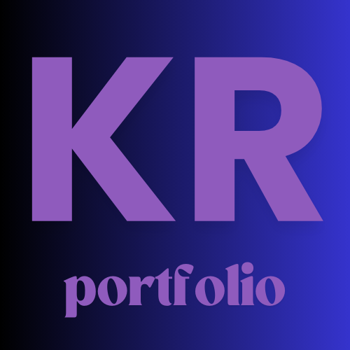

#  Front-end Developer - Portfolio 

Project built in Next.js💜

Welcome to my protfolio website!

Get to know me, explore my projects, and dive into my professional journey.

## Technologies Used

## Acknowledgements

- [ByteGrad - Youtube portfolio mould](https://www.youtube.com/watch?v=sUKptmUVIBM)

- [React icons](https://react-icons.github.io/react-icons/)

- [clsx](https://www.npmjs.com/package/clsx)

- [react-intersection-observer](https://www.npmjs.com/package/react-intersection-observer)

- [Framer](https://motion.dev/docs/react-quick-start)

## License

[MIT](https://choosealicense.com/licenses/mit/)

## Contact

Created by Kasia Rosińska [@RosinskaK](https://www.linkedin.com/in/katarzyna-rosinska/) - feel free to contact me! 👋
